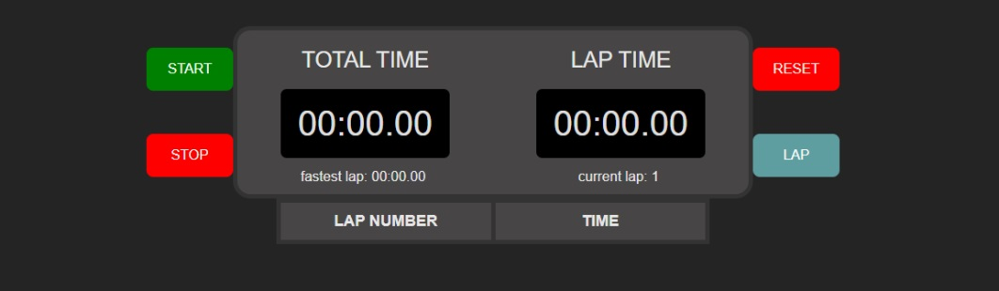
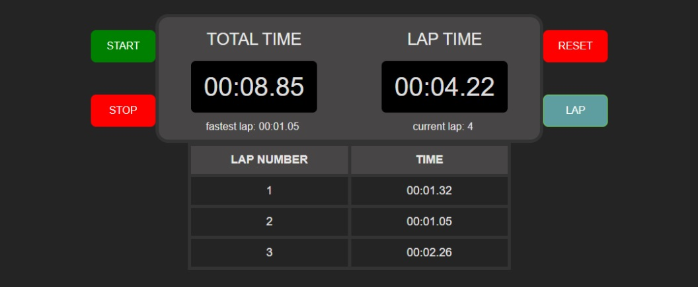
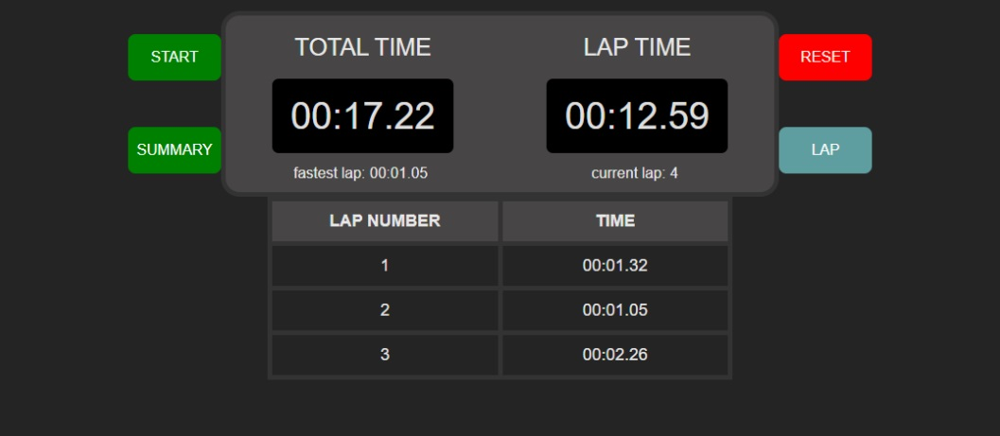
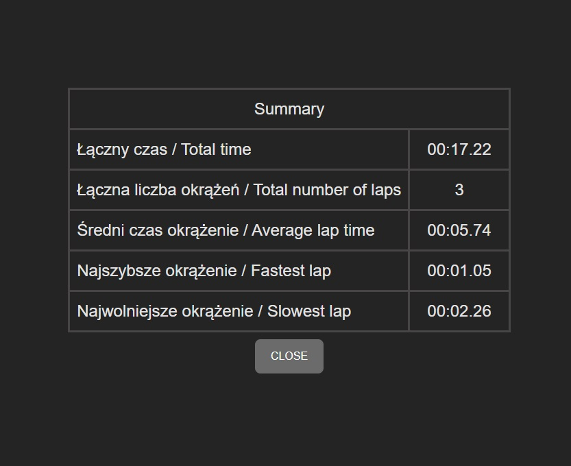

# StopWatch

## Project Description

StopWatch is a stopwatch application with the ability to add laps and a summary table containing:
- Total time
- Total number of laps
- Average lap time
- Fastest lap
- Slowest lap

This project was completed as part of the FRONTOWCY course.

## Sample Screenshots







## Features

- Measuring total time and individual lap times
- Summary table of results

## Technologies
# React + TypeScript + Vite

- [React](https://reactjs.org/)
- [Vite](https://vitejs.dev/)
- [TypeScript](https://www.typescriptlang.org/)

## Installation

### Yarn

```bash
yarn install
yarn dev
```

### npm

```bash
npm install
npm run dev
```

## Usage

After completing the installation, to run the application, use one of the following commands depending on your chosen package manager:

### Yarn

```bash
yarn dev
```

### npm

```bash
npm run dev
```


## Contact

Konrad - dzumanet@gmail.com
https://github.com/Dzumanet
